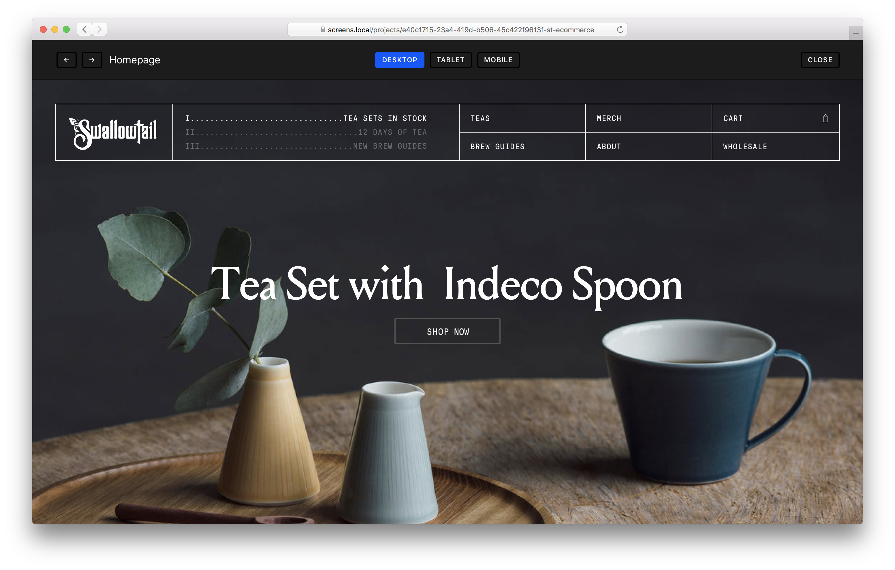
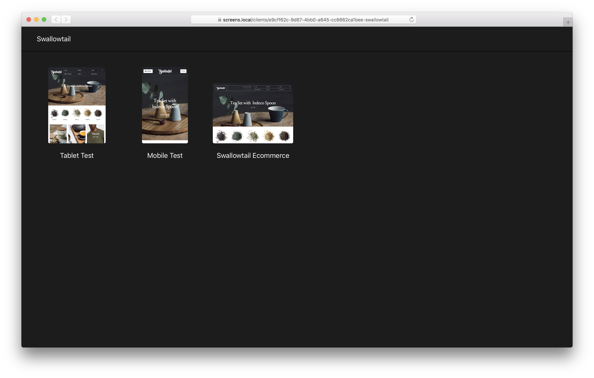

# Screens

Simple screen prototyping tool built on top of CraftCMS. It's like Invision or Marvel, but free!




## Requirements
- MAMP
- PHP 7+
- MySQL 5+
- Node 8+
- Yarn 

## Local Development

*Local development requires MAMP.*

1. Install Composer dependencies
```
$ composer install
```
2. Install Yarn dependencies
```
$ yarn install
```
3. Run CraftCMS required permissions script
```
$ sh scripts/set-permissions.sh
```
4. Copy `.env.example` to `.env` and add your settings.
5. Pull down DB backup and import into your local MySQL environment.
6. Point `screens.local` in your hosts (via MAMP or hosts file) to the `web` directory and restart MAMP servers.
7. Start local development server for live reload changes
```
$ yarn start
```

## To Do

* Proper migration for setup
* Screen specific URLs
* More prototyping tools like image map hyperlinks and transitions